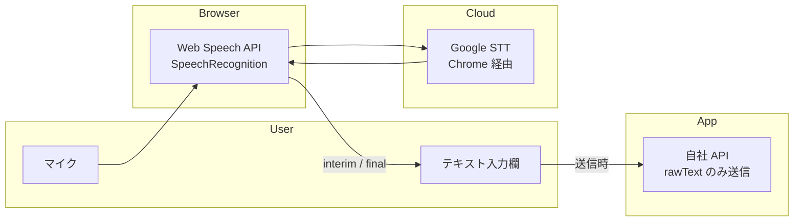

# 音声入力パターン（Web Speech API）

ShapeIt で実装・検証済みの音声入力を、他プロダクト（Chrome 拡張・Web アプリ）でも再利用するためのガイドです。

---

## 概要

### 何を使っているか

| 項目 | 内容 |
|------|------|
| **API** | [Web Speech API](https://developer.mozilla.org/en-US/docs/Web/API/Web_Speech_API) の `SpeechRecognition` / `webkitSpeechRecognition` |
| **STT エンジン** | Chrome では Google のクラウド音声認識（ブラウザが中継） |
| **言語** | `ja-JP` 固定 |
| **外部サービス** | Whisper / Azure Speech / 自前 STT は **使っていない** |
| **音声ファイル** | 拡張機能では送らない（転写テキストのみ） |

### なぜこの方式か

- **実装コストが低い** — 数十行でリアルタイム文字起こしが動く
- **日本語の精度が高い** — Chrome 上では Google STT の品質をそのまま利用できる
- **追加インフラ不要** — API キー・サーバー・課金設定が不要
- **UX が自然** — `interimResults` により「話している最中から文字が出る」

### 制約・注意点

- **ネットワーク必須**（`network` エラーが出ることがある）
- **Chrome / Edge が主戦場**（Safari・Firefox は非対応または不安定）
- **マイク許可**は実行時にブラウザ / OS が要求（Manifest の `microphone` 権限は Chrome 拡張では通常不要）
- **プライバシー** — 音声は Google のクラウドに送られる（オンプレ STT が必要な場合は別方式）

---

## アーキテクチャ



**ShapeIt でのデータの流れ**

1. ユーザーが報告を開始（FAB / ショートカット / ポップアップ）
2. オーバーレイ表示 → **300ms 後に音声認識を自動開始**
3. 話した内容が textarea にリアルタイム反映
4. **2 秒無音**で認識停止 → 確認画面へ
5. 送信時、転写テキストを `rawText` として API に POST

---

## コア実装パターン（他プロダクトにコピー可能）

### 1. ブラウザ対応チェック

```typescript
type SpeechSupport = "web-speech" | "keyboard-dictation" | "audio-only";

function detectSpeechSupport(): SpeechSupport {
  const SR =
    (window as unknown as { SpeechRecognition?: unknown }).SpeechRecognition ||
    (window as unknown as { webkitSpeechRecognition?: unknown }).webkitSpeechRecognition;
  if (SR) return "web-speech";
  if (/iP(hone|ad|od)/.test(navigator.userAgent)) return "keyboard-dictation";
  return "audio-only";
}
```

**参照:** `shapeit/app/src/lib/speechRecognition.ts`

### 2. 音声認識の開始・停止（共通ライブラリ）

```typescript
export function startLiveSpeech(opts: {
  onInterim?: (text: string) => void;
  onFinal?: (text: string) => void;
  onError?: (code: string) => void;
  onEnd?: () => void;
}): { stop: () => void } | null {
  const Ctor =
    (window as unknown as { SpeechRecognition?: new () => Rec }).SpeechRecognition ||
    (window as unknown as { webkitSpeechRecognition?: new () => Rec }).webkitSpeechRecognition;
  if (!Ctor) return null;

  const rec = new Ctor();
  rec.lang = "ja-JP";       // 日本語固定
  rec.continuous = true;     // 連続認識（区切りで止まらない）
  rec.interimResults = true; // 途中結果をリアルタイム表示

  rec.onresult = (ev) => {
    let finalText = "";
    let interim = "";
    for (let i = ev.resultIndex; i < ev.results.length; i++) {
      const t = ev.results[i][0]?.transcript ?? "";
      if (ev.results[i].isFinal) finalText += t;
      else interim += t;
    }
    if (interim) opts.onInterim?.(interim);
    if (finalText) opts.onFinal?.(finalText);
  };
  rec.onerror = (ev) => opts.onError?.(ev.error || "error");
  rec.onend = () => opts.onEnd?.();
  rec.start();

  return { stop: () => rec.stop() };
}
```

**参照:** `shapeit/app/src/lib/speechRecognition.ts`

### 3. テキスト欄への追記ロジック（重要）

既存テキストを壊さず、確定文と途中結果を分けて扱うのが UX の要です。

```typescript
// パターン A: base + interim + finalChunk（拡張機能オーバーレイ向け）
let base = textarea.value.trim();

rec.onresult = (ev) => {
  let finalChunk = "";
  let interim = "";
  for (let i = ev.resultIndex; i < ev.results.length; i++) {
    const t = ev.results[i][0]?.transcript ?? "";
    if (ev.results[i].isFinal) finalChunk += t;
    else interim += t;
  }
  // 途中結果: base の後ろに interim を表示（確定前は上書き的に見える）
  if (interim) textarea.value = base ? `${base}${interim}` : interim;
  // 確定結果: base に追記して確定
  if (finalChunk) {
    base = base ? `${base}${finalChunk}` : finalChunk;
    textarea.value = base;
  }
};
```

```typescript
// パターン B: React 向け（baseRef + onChange）
const baseRef = useRef("");
const composeWithInterim = (base: string, interimText: string) =>
  interimText ? (base ? `${base}\n${interimText}` : interimText) : base;

startLiveSpeech({
  onInterim: (t) => onChange(composeWithInterim(baseRef.current, t)),
  onFinal: (t) => {
    const next = baseRef.current ? `${baseRef.current}\n${t}` : t;
    onChange(next);
    baseRef.current = next;
  },
});
```

**参照:**
- パターン A: `shapeit/extension/src/pageReporter.ts` の `startSpeech()`
- パターン B: `shapeit/app/src/components/VoiceInputButton.tsx`

### 4. 無音検出（自動で次のステップへ）

ShapeIt の即時報告では、話し終わったら自動で確認画面に進みます。

```typescript
let silenceTimer: ReturnType<typeof setTimeout> | null = null;

rec.onresult = (ev) => {
  // ... テキスト更新 ...

  if (silenceTimer) clearTimeout(silenceTimer);
  silenceTimer = setTimeout(() => {
    stopSpeech();
    onSilence(); // 例: 確認画面へ遷移
  }, 2000); // 2 秒無音
};
```

**参照:** `shapeit/extension/src/pageReporter.ts` 233–238 行

### 5. エラーハンドリング

| `ev.error` | ユーザー向けメッセージ |
|------------|------------------------|
| `not-allowed` | マイクの許可が必要です |
| `network` | 音声認識にネットワーク接続が必要です |
| その他 | 音声認識に失敗しました |

```typescript
rec.onerror = (ev) => {
  const code = ev.error || "error";
  stopSpeech();
  if (code === "not-allowed") setStatus("マイクの許可が必要です");
  else if (code === "network") setStatus("音声認識にネットワーク接続が必要です");
  else setStatus("音声認識に失敗しました");
};
```

**参照:** `shapeit/extension/editor.js` の `startSpeechForTarget()`

---

## ShapeIt での実装箇所

### Chrome 拡張機能

| ファイル | 役割 |
|----------|------|
| `shapeit/extension/src/pageReporter.ts` | **メイン UX** — 全ページオーバーレイ、自動音声開始、無音検出 |
| `shapeit/extension/editor.js` | 詳細編集ポップアップ（気づき欄・文字注釈） |
| `shapeit/extension/editor.html` | マイクボタン UI |
| `shapeit/extension/editor.css` | マイクボタンのアクティブ状態・パルスアニメーション |
| `shapeit/extension/src/background.ts` | スクショ取得後にオーバーレイ表示を指示（音声処理はしない） |
| `shapeit/extension/src/submitFeedback.ts` | 転写テキストを `rawText` として API 送信 |
| `shapeit/extension/manifest.json` | `microphone` 権限は **宣言していない** |

#### 拡張機能の UX 設計ポイント

| 機能 | 実装 |
|------|------|
| 自動音声開始 | オーバーレイ表示 300ms 後に `startSpeech()`（コメントのみ報告は手動） |
| トグル操作 | 同じマイクボタンで開始 / 停止 |
| 無音で次へ | 最終結果から 2 秒無音 → `goConfirm()` |
| Shadow DOM | オーバーレイは `attachShadow({ mode: "closed" })` でページ CSS と干渉しない |
| 送信データ | 音声ファイルなし、`rawText` のみ |

```typescript
// 自動音声開始（pageReporter.ts）
textarea.focus();
if (!payload.commentOnly) {
  setTimeout(() => startSpeech(textarea, micBtn, goConfirm), 300);
}
```

### Web アプリ（React）

| ファイル | 役割 |
|----------|------|
| `shapeit/app/src/lib/speechRecognition.ts` | 共通ライブラリ（検出 + 開始 / 停止） |
| `shapeit/app/src/components/VoiceInputButton.tsx` | 環境横断 UI（Web Speech / キーボード誘導 / 非対応表示） |
| `shapeit/app/src/pages/CapturePage.tsx` | キャプチャ画面（Web Speech + MediaRecorder フォールバック） |

#### Web アプリの環境分岐

`VoiceInputButton` は 3 段階のフォールバックを持ちます。

1. **`web-speech`** — `SpeechRecognition` が使える → アプリ内マイクボタン
2. **`keyboard-dictation`** — iOS PWA など → 「キーボードのマイクで話す」に誘導
3. **`audio-only`** — 非対応 → 音声添付 or 手入力（`CapturePage` 側で MediaRecorder）

---

## 他プロダクトへの移植手順

### Step 1: 共通ライブラリをコピー

`shapeit/app/src/lib/speechRecognition.ts` を対象プロダクトの `src/lib/` などにコピーします。  
依存はなく、そのまま使えます。

### Step 2: UI コンポーネントを選ぶ

| プロダクト種別 | 推奨 |
|----------------|------|
| React Web アプリ | `VoiceInputButton.tsx` をベースにカスタマイズ |
| Chrome 拡張（コンテンツスクリプト） | `pageReporter.ts` の `startSpeech()` パターン |
| Chrome 拡張（拡張ページ） | `editor.js` の `startSpeechForTarget()` パターン |
| バニラ JS | `startLiveSpeech()` + textarea 直接更新 |

### Step 3: UX オプションを決める

| オプション | 推奨シーン |
|------------|------------|
| 自動音声開始 | 報告・入力フローの最初のステップが「話す」場合 |
| 無音検出 | ハンズフリーで次の画面へ進めたい場合 |
| 手動トグルのみ | 編集画面など、ユーザーが明示的に ON/OFF したい場合 |

### Step 4: 送信形式を決める

ShapeIt では転写テキストのみ送信しています。

```typescript
const body = {
  rawText: transcribedText,  // 音声認識結果
  // audioDataUrl は拡張機能では送らない
};
```

音声ファイルも残したい場合は、Web アプリ側の `CapturePage.tsx` の MediaRecorder パターンを参照してください。

### Step 5: マニフェスト（Chrome 拡張の場合）

```json
{
  "permissions": ["activeTab", "storage", "tabs", "scripting"],
  "host_permissions": ["<all_urls>"]
}
```

`microphone` は Manifest V3 でも通常 **不要** です。コンテンツスクリプトや拡張ページのコンテキストで `SpeechRecognition` を呼ぶと、Chrome がマイク許可を管理します。

---

## 最小実装例（コピペ用）

HTML + バニラ JS で動く最小サンプルです。

```html
<textarea id="input" rows="4" placeholder="話すか入力…"></textarea>
<button type="button" id="mic">🎤 音声</button>

<script>
  const textarea = document.getElementById("input");
  const micBtn = document.getElementById("mic");
  let rec = null;
  let base = "";

  function stop() {
    if (rec) { try { rec.stop(); } catch {} rec = null; }
    micBtn.classList.remove("active");
  }

  micBtn.addEventListener("click", () => {
    const Ctor = window.SpeechRecognition || window.webkitSpeechRecognition;
    if (!Ctor) { alert("非対応ブラウザです"); return; }
    if (rec) { stop(); return; }

    base = textarea.value.trim();
    rec = new Ctor();
    rec.lang = "ja-JP";
    rec.continuous = true;
    rec.interimResults = true;
    rec.onresult = (ev) => {
      let finalChunk = "", interim = "";
      for (let i = ev.resultIndex; i < ev.results.length; i++) {
        const t = ev.results[i][0]?.transcript ?? "";
        if (ev.results[i].isFinal) finalChunk += t;
        else interim += t;
      }
      if (interim) textarea.value = base ? base + interim : interim;
      if (finalChunk) {
        base = base ? base + finalChunk : finalChunk;
        textarea.value = base;
      }
    };
    rec.onerror = () => stop();
    rec.onend = () => { rec = null; micBtn.classList.remove("active"); };
    rec.start();
    micBtn.classList.add("active");
  });
</script>
```

---

## ブラウザ・環境別の対応表

| 環境 | Web Speech API | 推奨フォールバック |
|------|----------------|-------------------|
| Chrome（デスクトップ） | ✅ 良好 | — |
| Edge | ✅ 良好 | — |
| Chrome 拡張（コンテンツスクリプト） | ✅ 良好 | — |
| Safari（macOS / iOS） | △ 不安定 or 非対応 | キーボード音声入力 |
| Firefox | ❌ 非対応 | 手入力 or 外部 STT |
| iOS PWA | △ 制限あり | キーボードのマイク誘導 |
| オフライン | ❌ `network` エラー | 手入力 or 音声録音のみ |

---

## 使っていないもの（現状）

| 技術 | 理由 |
|------|------|
| OpenAI Whisper | サーバー・API キー・レイテンシが増える。Chrome 上では Web Speech で十分 |
| MediaRecorder（拡張機能） | 転写テキストだけで UX が成立している |
| 自前 STT サーバー | 運用コスト・開発コスト |
| `voice_transcript` 専用フィールド | `rawText` に統合済み |

Web アプリ（`CapturePage`）のみ、文字起こし非対応端末向けに MediaRecorder による音声添付フォールバックがあります。

---

## 今後 STT を差し替える場合

Web Speech API のインターフェースを薄いラッパー（`startLiveSpeech`）に閉じ込めているため、差し替えは比較的容易です。

```typescript
// 将来の差し替えイメージ
export function startLiveSpeech(opts: SpeechOpts): { stop: () => void } | null {
  if (useWhisper()) return startWhisperStream(opts);
  return startWebSpeech(opts); // 現行
}
```

呼び出し側（`VoiceInputButton`、オーバーレイ UI）は `onInterim` / `onFinal` / `onError` / `onEnd` のコールバックだけに依存しているため、UI 層の変更は最小限で済みます。

---

## 関連ファイル一覧（ShapeIt）

```
shapeit/
├── extension/
│   ├── src/
│   │   ├── pageReporter.ts      # メイン音声 UX（自動開始・無音検出）
│   │   ├── submitFeedback.ts    # rawText 送信
│   │   └── background.ts        # オーバーレイ表示トリガー
│   ├── editor.js                # 詳細編集の音声入力
│   ├── editor.html / editor.css # マイク UI
│   └── manifest.json
└── app/
    └── src/
        ├── lib/speechRecognition.ts      # 共通ライブラリ（移植の起点）
        ├── components/VoiceInputButton.tsx
        └── pages/CapturePage.tsx         # MediaRecorder フォールバック
```

---

## 更新履歴

| 日付 | 内容 |
|------|------|
| 2026-08-22 | 初版（ShapeIt 実装をもとに横断ドキュメント化） |
